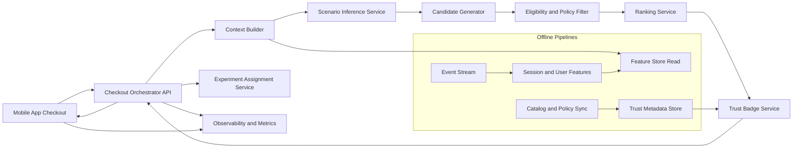
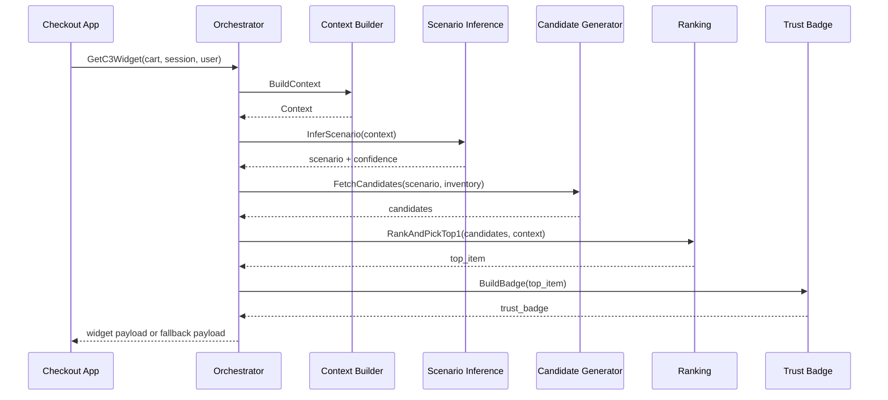

# C3 Architecture: Contextual Cart Companion (MVP)

## 1. Purpose
Design an AI-native checkout companion that increases cross-category discovery and conversion without adding friction to routine grocery checkout.

This architecture is derived from the PRD in `problemstatement.md` and focuses on MVP feasibility, low latency, and measurable business impact.

## 2. Product Objective and Constraints

### Objective
Increase the percentage of Monthly Active Customers (MACs) purchasing from at least one new non-FMCG category each month.

### Hard Constraints
- Do not reduce checkout completion rate.
- End-to-end recommendation response must stay under 1500 ms.
- Show exactly one highly relevant recommendation near checkout CTA.
- Always attach an explicit trust badge for non-FMCG recommendations.

### MVP Non-Goals
- Full-page lifestyle discovery feed.
- Multi-item recommendation carousel.
- Personalized long-term conversational assistant.

## 3. High-Level Architecture



## 4. Core Components

### 4.1 Checkout Orchestrator API
- Single online entrypoint called by checkout screen.
- Handles timeout budget and fallback strategy.
- Returns widget payload with:
  - recommendation item
  - scenario label
  - trust badge text
  - experiment variant id

### 4.2 Context Builder
Builds request context from:
- current cart items and quantities
- local time and day-of-week
- recent order history summary
- session intent signals (search term, buy-again usage)
- city and serviceability constraints

### 4.3 Scenario Inference Service
Infers a lifestyle scenario (examples: WFH rush, weekend social, grooming emergency).

MVP approach:
- Hybrid model:
  - deterministic rules for precision on high-confidence patterns
  - lightweight ML classifier for broader recall
- Output:
  - scenario_id
  - confidence score
  - top explanatory features (for debugging only)

### 4.4 Candidate Generator
Generates candidate SKUs mapped to scenario and cart context.

Sources:
- scenario-to-category mapping table
- inventory-available SKUs in the user dark-store cluster
- merchant and compliance eligibility

### 4.5 Eligibility and Policy Filter
Removes candidates that fail trust, logistics, or UX constraints:
- out of stock
- missing return/replacement policy metadata
- missing warranty metadata when category requires it
- age-restricted or city-restricted ineligible SKUs
- surge-sensitive thresholds (optional policy gate)

### 4.6 Ranking Service
Scores remaining candidates using weighted utility:
- relevance to inferred scenario
- attach probability (ATC likelihood)
- expected margin contribution
- checkout friction risk penalty

Returns top 1 item only.

### 4.7 Trust Badge Service
Builds trust copy shown in widget.

Inputs:
- category
- warranty availability
- return or replacement terms
- expiry freshness SLA (where relevant)
- brand authenticity marker

Outputs examples:
- "1-year official brand warranty"
- "7-day easy replacement"
- "freshness and expiry verified"

### 4.8 Experiment Assignment Service
- Deterministic user bucketing for A/B testing.
- Supports holdout, control (static recs), and treatment (C3).

### 4.9 Observability and Metrics
Tracks business and guardrail telemetry:
- recommendation shown
- recommendation clicked
- recommendation ATC
- order completed
- checkout time delta
- API latency and fallback rate

## 5. Online Request Flow



## 6. Latency Budget (P95)

Target end-to-end under 1500 ms.

| Stage | P95 Budget (ms) |
| --- | ---: |
| Network in + auth + orchestration overhead | 120 |
| Context build and feature reads | 180 |
| Scenario inference | 250 |
| Candidate generation + filtering | 300 |
| Ranking | 150 |
| Trust badge resolution | 120 |
| Response assembly + network out | 180 |
| Buffer | 200 |
| Total | 1500 |

Fallback policy:
- If any critical dependency breaches its timeout, return static recommendation payload in under 900 ms.
- Never block checkout CTA rendering on C3 response.

## 7. Data Architecture

### 7.1 Online Stores
- Feature Store (low-latency key-value):
  - user recency features
  - cross-category exposure counters
  - historical attach signals
- Catalog Index:
  - SKU metadata, category, price, margin band
  - inventory and serviceability
- Trust Metadata Store:
  - warranty terms
  - return or replacement policies
  - expiry-freshness rules for sensitive categories

### 7.2 Event Schema (MVP)
- c3_widget_impression
- c3_widget_click
- c3_widget_add_to_cart
- c3_widget_dismiss
- c3_order_conversion
- c3_latency_trace

Required dimensions:
- user_id (hashed)
- session_id
- order_id
- scenario_id
- sku_id
- variant_id
- timestamp
- city_id

## 8. Ranking Strategy (MVP)

Use a weighted score:

S = w1*Relevance + w2*AttachProb + w3*MarginLift - w4*FrictionRisk

Where:
- Relevance from scenario and cart similarity.
- AttachProb from historical behavior priors.
- MarginLift from expected contribution per order.
- FrictionRisk penalizes expensive or low-trust candidates during surge or rushed contexts.

MVP can start with calibrated logistic regression or gradient-boosted trees and move to contextual bandits post-baseline stability.

## 9. Trust System Design

### Trust Badge Decision Matrix
- Electronics:
  - require warranty metadata
  - prefer replacement policy badge
- Beauty and personal care:
  - require expiry-freshness metadata
  - show ingredient or authenticity marker when available
- Pet care:
  - require variant and safety metadata

If required trust metadata is missing, candidate is filtered out.

## 10. Guardrails and Safety
- Checkout guardrail: no statistically significant drop in checkout completion.
- UX guardrail: no additional mandatory steps.
- Performance guardrail: P95 under 1500 ms, fallback rate under agreed threshold.
- Policy guardrail: no recommendation without minimum trust metadata.

## 11. Experimentation Plan

### Experiment Arms
- A: Holdout (no widget)
- B: Control (static recommendation)
- C: Treatment (C3 contextual + trust badge)

### Primary Success Metric
- Percent uplift in MACs purchasing at least one new non-FMCG category.

### Secondary Metrics
- Widget ATC rate
- Order AOV lift
- Margin per order lift

### Guardrail Metrics
- Checkout completion rate
- Checkout duration delta
- C3 response latency and fallback rate

## 12. Rollout Plan

### Phase 0: Shadow Mode
- Run inference and ranking silently.
- Validate latency, coverage, trust metadata completeness.

### Phase 1: 5 percent Traffic
- Limited cities and high-frequency user segment.
- Monitor guardrails daily.

### Phase 2: 25 percent Traffic
- Expand scenarios and categories gradually.
- Tune ranking weights based on observed lift.

### Phase 3: 50 to 100 percent
- Scale after significance on primary metric and no guardrail regressions.

## 13. MVP Risks and Mitigations
- Risk: Low trust metadata coverage.
  - Mitigation: strict eligibility filter + fallback recommendation.
- Risk: Latency spikes due to catalog or feature reads.
  - Mitigation: caching, timeout budgets, circuit breakers.
- Risk: Irrelevant suggestions harming user trust.
  - Mitigation: top-1 only, confidence threshold, conservative ranking penalties.

## 14. API Contract (Proposed)

### Request
```json
{
  "user_id": "hashed_user",
  "session_id": "session_123",
  "cart": [{"sku_id": "milk_1l", "qty": 1}],
  "city_id": "blr",
  "timestamp": "2026-07-25T09:10:11Z"
}
```

### Response
```json
{
  "variant_id": "C",
  "scenario": {"id": "wfh_rush", "confidence": 0.82},
  "recommendation": {
    "sku_id": "usb_c_charger_30w",
    "title": "30W USB-C Fast Charger",
    "price_inr": 499
  },
  "trust_badge": {
    "type": "warranty",
    "text": "1-year official brand warranty"
  },
  "fallback": false,
  "latency_ms": 612
}
```

## 15. Definition of Done for MVP
- C3 widget delivered in checkout with top-1 recommendation.
- Trust badge displayed for every shown recommendation.
- P95 response under 1500 ms across test cities.
- No guardrail regression in checkout completion.
- Statistically significant lift in new-category MAC adoption in treatment versus control.
