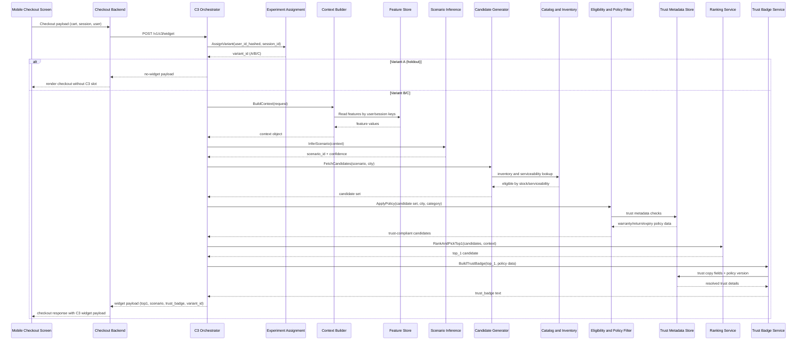
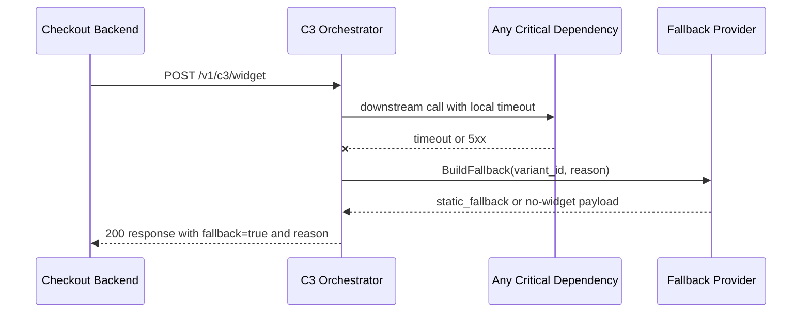

# C3 Concrete Deployment Call Path

## 1. Purpose
Map the production request path from mobile checkout UI to C3 services as a deployment sequence, aligned with existing architecture and API spec.

## 2. Runtime Entry Point
- Client surface: checkout cart screen in mobile app
- Caller service: checkout backend
- C3 API: `POST /v1/c3/widget`
- API contract source: Phase 0 API spec v1

## 3. Deployment Units
- Mobile App (Android and iOS)
- Checkout Backend Service
- C3 Orchestrator Service
- Context Builder Service
- Scenario Inference Service
- Candidate Generator Service
- Eligibility and Policy Filter Service
- Ranking Service
- Trust Badge Service
- Fallback Provider
- Feature Store (online)
- Catalog and Inventory Store (online)
- Trust Metadata Store (online)
- Experiment Assignment Service
- Observability stack (traces, metrics, logs)

## 4. Network and Ownership Boundaries
- Mobile App -> Checkout Backend: public mobile API boundary (existing checkout path)
- Checkout Backend -> C3 Orchestrator: service-to-service internal call with token auth
- C3 Orchestrator -> downstream C3 services: internal service mesh or VPC calls
- C3 services -> online stores: low-latency read paths only

## 5. Concrete Request Sequence (Happy Path)

## 6. Concrete Failure and Fallback Sequence

Fallback reasons (taxonomy):
- timeout_dependency
- trust_ineligible_candidates
- empty_candidate_set
- service_error
- configuration_forced

## 7. Time Budget by Hop (P95)
- Orchestrator overhead: 120 ms
- Context build + feature read: 180 ms
- Scenario inference: 250 ms
- Candidate generation + policy filtering: 300 ms
- Ranking: 150 ms
- Trust badge resolution: 120 ms
- Response assembly + egress: 180 ms
- Buffer: 200 ms
- Total target: <= 1500 ms

Fallback behavior:
- If critical path budget is at risk, orchestrator short-circuits and returns fallback.
- Target fallback return: <= 900 ms from orchestrator start.

## 8. UI Integration Mapping (Client)
- Placement: directly above checkout CTA
- States:
  - loading skeleton (non-blocking)
  - contextual recommendation (Variant C)
  - static fallback (Variant B or degraded C)
  - hidden slot (Variant A or no-safe-output)
- Trust overlay: opened from trust badge for supported categories (for example electronics)

## 9. Deployment Sequence by Environment
1. Deploy C3 services to `c3-staging` namespace with pinned versions.
2. Validate health probes and distributed tracing across all hops.
3. Run staging acceptance tests for happy path, trust rejection, and fallback paths.
4. Enable production in shadow mode first (no user-visible widget).
5. Progress to 5 percent treatment with kill switch active.
6. Ramp to 25 percent after guardrail and significance checks.
7. Execute Phase 7 city-wave scale decision and rollout to 50 to 100 percent.

## 10. Observability and Trace Correlation
Carry these tags through all service hops:
- request_id
- session_id
- variant_id
- scenario_id
- city_id

Required operational dashboards:
- end-to-end p50/p95 latency
- fallback rate by reason
- trust gate rejection by category
- checkout guardrail deltas vs control

## 11. Minimum Interface Contracts per Hop
- Checkout Backend -> Orchestrator: request schema from API v1
- Orchestrator -> Scenario Inference: `context` -> `scenario_id, confidence`
- Orchestrator -> Candidate Generator: `scenario_id, city` -> `candidate_set`
- Orchestrator -> Policy Filter: `candidate_set` -> `trust_compliant_set`
- Orchestrator -> Ranking: `trust_compliant_set, context` -> `top_1`
- Orchestrator -> Trust Badge: `top_1, policy metadata` -> `trust_badge`

## 12. Ownership at Runtime
- Mobile team: widget rendering, non-blocking behavior, client telemetry hooks
- Checkout backend: request assembly and integration with orchestrator endpoint
- Backend platform: orchestration, timeout control, fallback response guarantees
- ML and recommender: scenario inference, candidate generation, ranking behavior
- Catalog and trust: trust metadata freshness and policy correctness
- Data and analytics: event integrity and experiment readouts
- SRE: reliability, alerts, on-call response, rollback execution
