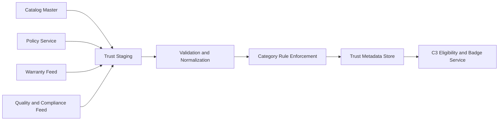

# Phase 1 Deliverable: Trust Metadata Pipeline and Freshness SLA

## 1. Objective
Set up a robust trust metadata pipeline so C3 recommendations for non-FMCG categories always carry valid trust badges and policy-safe attributes.

## 2. Trust Metadata Domains
- Warranty metadata
- Return or replacement policy metadata
- Expiry freshness metadata
- Variant and safety metadata
- Brand authenticity marker
- Policy versioning metadata

## 3. Source Systems
| Source | Data | Frequency | Owner |
| --- | --- | --- | --- |
| Catalog Master | SKU, category, brand | near real-time plus daily full sync | Catalog |
| Policy Service | return or replacement terms, policy version | hourly | Trust Ops |
| Vendor Warranty Feed | warranty availability and term | daily | Category Ops |
| Quality and Compliance Feed | expiry SLA and safety flags | daily | Quality Ops |

## 4. Canonical Trust Schema
| Field | Type | Null Allowed | Category Requirement |
| --- | --- | --- | --- |
| sku_id | string | No | All |
| category_l1 | enum | No | All |
| warranty_available | bool | Yes | Required for electronics |
| warranty_term_months | int | Yes | Optional |
| return_or_replacement_policy | enum | Yes | Required by configured categories |
| expiry_freshness_days_min | int | Yes | Required for beauty and pet care |
| safety_variant_verified | bool | Yes | Required for pet care |
| brand_authenticity_verified | bool | Yes | Optional but recommended |
| policy_version | string | No | All trust-badged items |
| updated_at | timestamp | No | All |

## 5. Ingestion and Processing Flow

## 6. Category Eligibility Rules
- Electronics:
  - Must have warranty_available = true
  - Must have policy_version and return or replacement policy
- Beauty and personal care:
  - Must have expiry_freshness_days_min
  - Must have policy_version
- Pet care:
  - Must have expiry_freshness_days_min
  - Must have safety_variant_verified = true

Candidates failing rules are marked ineligible and never surfaced by C3.

## 7. Freshness SLA

### Data Freshness Targets
- Policy fields: <= 6 hours staleness
- Warranty fields: <= 24 hours staleness
- Expiry and safety fields: <= 24 hours staleness
- Canonical trust row updated_at: <= 24 hours for launch-eligible SKUs

### Coverage Target
- >= 95% trust metadata completeness for launch-eligible SKUs by city.

### Reliability Targets
- Daily full sync success: >= 99%
- Incremental sync success: >= 99.5%

## 8. Data Quality Controls
- Hard null checks on category-mandatory fields.
- Enum validation for policy values.
- Duplicate sku_id collapse using latest updated_at.
- Schema drift detection for upstream field changes.

## 9. Incident Handling
- Severity 0: policy contradiction or legal violation risk.
  - Action: disable affected category recommendations immediately.
- Severity 1: completeness drops below threshold in launch city.
  - Action: city-level allowlist reduction and data incident.
- Severity 2: freshness breach for non-critical optional fields.
  - Action: track and resolve in next sync cycle.

## 10. Monitoring and Alerts
- Coverage alert by city and category.
- Freshness breach alert based on updated_at lag.
- Policy mismatch alert against policy service source of truth.
- Ingestion failure alert by upstream feed.

## 11. Ownership and RACI
- Responsible: Data Engineering, Catalog and Trust.
- Accountable: Catalog and Trust Lead.
- Consulted: Backend, Legal and Compliance, Product.
- Informed: SRE, Mobile, Analytics.

## 12. Phase 1 Exit Criteria Mapping
- Deliverable met: trust metadata pipeline and freshness SLA document and controls.
- Go or no-go check 1: completeness >= 95% for launch-eligible SKUs.
- Go or no-go check 2: trust-critical freshness SLAs met in target launch cities.
