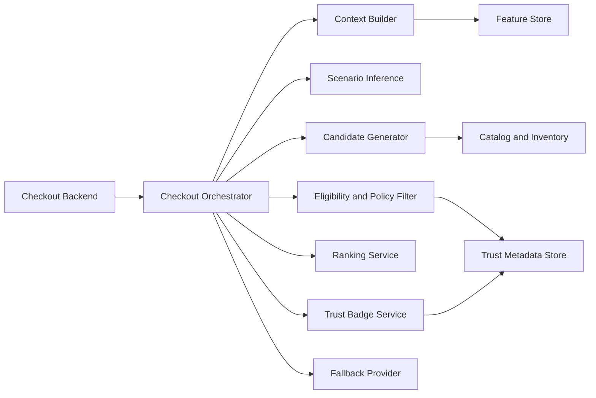

# Phase 2 Deliverable: Online Services Build and Staging Deployment Spec

## 1. Objective
Define implementation and staging deployment requirements for all Phase 2 online services in the C3 request path.

## 2. Scope
This document covers:
- Checkout Orchestrator API
- Context Builder
- Scenario Inference Service
- Candidate Generator
- Eligibility and Policy Filter
- Ranking Service
- Trust Badge Service
- Fallback handler

## 3. Service Topology

## 4. Staging Environments
- Environment name: c3-staging
- Scope: city-level data slices for BLR and MUM to simulate high-volume plus variance
- Isolation: dedicated namespace and feature flags to prevent test bleed into production paths

## 5. Service Contracts and Responsibilities

### 5.1 Checkout Orchestrator
Responsibilities:
- receive request and start latency timer
- call downstream services in bounded sequence
- apply timeout budgets
- return contextual recommendation or fallback

Required output:
- top-1 recommendation only
- trust badge for non-FMCG
- fallback flag and reason when degraded

### 5.2 Context Builder
Responsibilities:
- assemble request, session, time, and user signals
- validate required fields
- provide defaults when optional features missing

### 5.3 Scenario Inference Service
Responsibilities:
- infer scenario using hybrid rule plus lightweight model
- return scenario id and confidence
- expose model and rule version tags

### 5.4 Candidate Generator
Responsibilities:
- fetch scenario-category candidate pool
- filter by inventory and serviceability
- return deduped candidate list

### 5.5 Eligibility and Policy Filter
Responsibilities:
- enforce mandatory trust rules by category
- enforce compliance and city restrictions
- reject candidates missing trust-critical fields

### 5.6 Ranking Service
Responsibilities:
- score candidates with relevance, attach probability, margin lift, and friction penalty
- return top-1 candidate

### 5.7 Trust Badge Service
Responsibilities:
- produce deterministic trust copy from policy and trust metadata
- include policy version for traceability

### 5.8 Fallback Provider
Responsibilities:
- return static recommendation or no-widget payload
- guarantee response when dependency timeout or failure occurs

## 6. Timeout Budget (P95)
- Orchestrator overhead: 120 ms
- Context build and feature reads: 180 ms
- Scenario inference: 250 ms
- Candidate generation plus filter: 300 ms
- Ranking: 150 ms
- Trust badge resolution: 120 ms
- Response assembly and egress: 180 ms
- Buffer: 200 ms
- Total target: 1500 ms

Fallback trigger policy:
- if critical dependency exceeds local timeout budget, short-circuit to fallback
- return fallback payload target in under 900 ms from orchestrator start

## 7. Required Configuration
- Feature flags:
  - c3_enabled
  - c3_fallback_only
  - c3_disable_category_electronics
  - c3_disable_category_beauty
  - c3_disable_category_petcare
- Circuit breakers:
  - per downstream dependency
- Retry policy:
  - max 1 retry for idempotent read calls
  - no retries for slow dependencies beyond budget

## 8. Staging Deployment Checklist
- Build and publish service artifacts for all components.
- Deploy services with version pinning and rollback tags.
- Wire secrets and access policies for feature and trust stores.
- Confirm health checks and readiness probes per service.
- Validate distributed tracing across all service hops.

## 9. Staging Acceptance Tests
- Happy path returns contextual recommendation with trust badge.
- Missing trust field causes candidate rejection and alternate selection.
- Non-recoverable dependency failure returns fallback in allowed time.
- Empty candidate set returns static fallback with no checkout blocking.

## 10. Observability Requirements
- mandatory tags in traces: request_id, session_id, variant_id, scenario_id
- metrics:
  - p50, p95 latency per service
  - fallback rate by reason
  - trust filter reject counts by category
  - error rate by dependency

## 11. Exit Criteria Mapping
- Deployed services in staging: satisfied by completed deployment checklist and health checks.
- End-to-end staging p95 <= 1500 ms: validated by load test report.
- Fallback under dependency failure: validated by failure injection tests.
- No recommendation without trust metadata: validated by eligibility filter tests.
