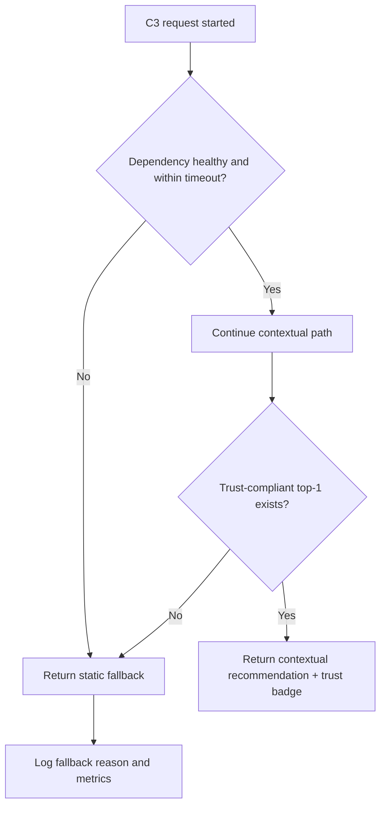

# Phase 2 Deliverable: Runbook for Failure Modes and Fallbacks

## 1. Objective
Provide operational runbooks for common and severe online service failures during staging and launch readiness.

## 2. Operating Principles
- Preserve checkout flow above all.
- Degrade recommendation quality before degrading checkout speed.
- Use category-level and global kill switches for trust safety.
- Make rollback decisions based on guardrail metrics, not intuition.

## 3. Trigger Thresholds
- Latency trigger: end-to-end p95 exceeds 1500 ms for 15 minutes.
- Fallback trigger: fallback rate exceeds threshold for 15 minutes.
- Trust trigger: missing trust badge for non-FMCG greater than 0.
- Error trigger: dependency 5xx spike over threshold for 10 minutes.

## 4. Runbook Scenarios

### RB-01 Feature Store Latency Spike
Symptoms:
- context build latency increases
- orchestrator nearing timeout budget

Immediate actions:
- enable c3_fallback_only if p95 not recovering
- reduce non-critical feature reads
- activate cache-preferred mode

Verification:
- p95 returns under threshold
- fallback responses stable and valid

Owner:
- Backend on-call with SRE support

### RB-02 Trust Metadata Store Outage
Symptoms:
- trust service failures or stale data surge

Immediate actions:
- disable non-FMCG categories with missing trust guarantees
- route to static fallback
- open incident with Catalog and Trust team

Verification:
- no non-FMCG recommendations without trust badge
- trust mismatch alarms resolved

Owner:
- Catalog and Trust on-call with Backend

### RB-03 Scenario Inference Degradation
Symptoms:
- inference timeout or confidence collapse

Immediate actions:
- force deterministic rules-only mode
- if still unstable, fallback-only mode

Verification:
- latency stabilizes
- no severe drop in checkout guardrails

Owner:
- ML on-call with Backend

### RB-04 Candidate Explosion or Empty Candidate Sets
Symptoms:
- very high candidate count causing rank delay
- frequent empty sets

Immediate actions:
- cap candidate pool size before ranking
- tune scenario-category mapping
- fallback on empty candidate outputs

Verification:
- ranking latency within budget
- stable recommendation coverage

Owner:
- ML and Backend

### RB-05 Policy Inconsistency Incident
Symptoms:
- trust badge text differs from policy source

Immediate actions:
- freeze affected category
- switch trust badge service to strict policy source mode
- notify Legal and Compliance

Verification:
- mismatch rate returns to zero

Owner:
- Catalog and Trust with Legal

### RB-06 Checkout Guardrail Regression
Symptoms:
- checkout completion drop beyond threshold

Immediate actions:
- disable treatment arm immediately
- keep holdout or control only
- begin cross-functional incident review

Verification:
- checkout metrics normalize
- incident root cause captured

Owner:
- Product incident commander with SRE and Engineering

## 5. Fallback Decision Tree

## 6. Incident Communication Template
- Incident ID:
- Start time:
- Trigger metric:
- Affected city or category:
- Current mode: normal, degraded, fallback-only, treatment-disabled
- User impact summary:
- Mitigation action taken:
- Next update ETA:

## 7. Recovery and Postmortem Requirements
- Confirm objective recovery metrics for 30 continuous minutes.
- Re-enable features gradually using canary flags.
- Publish postmortem including root cause, blast radius, and prevention tasks.

## 8. Drill Schedule
- Weekly tabletop drill for top 3 scenarios.
- Bi-weekly live failover drill in staging.
- One full launch rehearsal before Phase 5 traffic exposure.

## 9. Ownership Matrix
- Backend on-call: orchestration and fallback behavior.
- SRE on-call: alert triage, incident bridge, rollback execution.
- Catalog and Trust: trust and policy data integrity.
- ML: inference and ranking degradation controls.
- Product: guardrail decision authority.

## 10. Phase 2 Exit Criteria Mapping
- Runbooks delivered: completed by this document.
- Fallback reliability: each runbook includes immediate fallback actions and verification.
- Trust compliance: explicit category disable and policy consistency controls documented.
