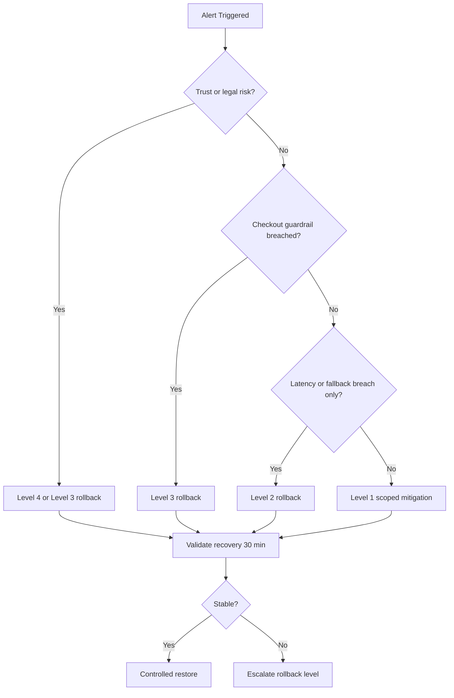

# Phase 5: Guardrail Rollback Playbook

## 1. Objective
Define deterministic rollback actions for 5% launch when guardrails, trust, or reliability thresholds are breached.

## 2. Principles
- Protect checkout experience first.
- Protect trust integrity second.
- Degrade recommendation functionality before broad launch rollback when safe.
- Prefer scoped rollback (category or city) before global rollback when impact is localized.

## 3. Rollback Trigger Matrix

| Trigger ID | Trigger Condition | Threshold | Severity | Default Action |
| --- | --- | --- | --- | --- |
| GR-01 | Checkout completion rate drop vs control | beyond agreed threshold and statistically significant window | Sev 0 | Disable treatment arm immediately |
| GR-02 | Checkout duration delta breach | beyond agreed tolerance for sustained window | Sev 1 | Enable fallback-only mode and evaluate treatment pause |
| GR-03 | End-to-end p95 latency breach | > 1500 ms for 15 min | Sev 1 | Enable fallback-only mode; if not recovering, disable treatment arm |
| GR-04 | Fallback rate breach | > agreed threshold for 15 min | Sev 1 | Identify top fallback reason and apply scoped mitigations |
| GR-05 | Non-FMCG trust compliance violation | violation count > 0 | Sev 0 | Disable impacted categories instantly; if broad, disable treatment arm |
| GR-06 | Policy mismatch rate spike | > agreed threshold | Sev 0 | Freeze category and switch to static control |
| GR-07 | Experiment telemetry integrity failure | event completeness < 99% sustained | Sev 2 | Pause analytical decisioning; maintain safest stable variant |

## 4. Action Ladder

### Level 1: Scoped Degradation
Use when impact is localized and guardrails remain mostly healthy.
- Disable affected category flag.
- Restrict impacted city.
- Increase confidence thresholds.
- Keep treatment active for unaffected segments.

### Level 2: Fallback-Only Mode
Use when service reliability is unstable but checkout remains healthy.
- Enable c3_fallback_only globally.
- Continue collecting telemetry.
- Block risky trust-sensitive categories if needed.

### Level 3: Treatment Disable
Use when user impact or trust risk is high.
- Disable treatment variant C.
- Route users to control experience.
- Preserve holdout and control for baseline monitoring.

### Level 4: Global Emergency Stop
Use for severe trust, legal, or checkout incidents.
- Trigger c3_kill_switch.
- Suppress all C3-driven outputs.
- Incident bridge with Product, Engineering, Data, SRE, Legal.

## 5. Decision Flow

## 6. Recovery Validation Checklist
Before restoring traffic:
- Guardrails stable for minimum 30 continuous minutes.
- p95 latency within threshold.
- Fallback rate within threshold.
- Trust compliance violations at zero.
- Incident commander and Product sign-off documented.

## 7. Controlled Restore Procedure
1. Restore from Level 4 to Level 3 or 2 for limited city set.
2. Observe for one full monitoring window.
3. Restore additional segments gradually.
4. Keep rapid rollback ready until full stability is confirmed.

## 8. Role Responsibilities
- Product Incident Commander: go or no-go decisions.
- SRE On-Call: executes flag changes and rollback actions.
- Backend On-Call: validates service recovery and fallback behavior.
- Data On-Call: validates metric correctness during incident.
- Catalog and Trust: handles policy and trust-data incidents.
- ML On-Call: handles threshold and ranking behavior issues.

## 9. Required Incident Artifacts
- Incident log entry from incident-log-template.md
- Metric snapshots before and after rollback
- Configuration and flag-change timeline
- Post-incident action plan

## 10. Go or No-Go Alignment for Phase 5
This playbook supports Phase 5 requirements by ensuring:
- instant rollback capability on checkout or trust harm
- deterministic handling of latency and fallback instability
- auditable decision making before traffic progression
